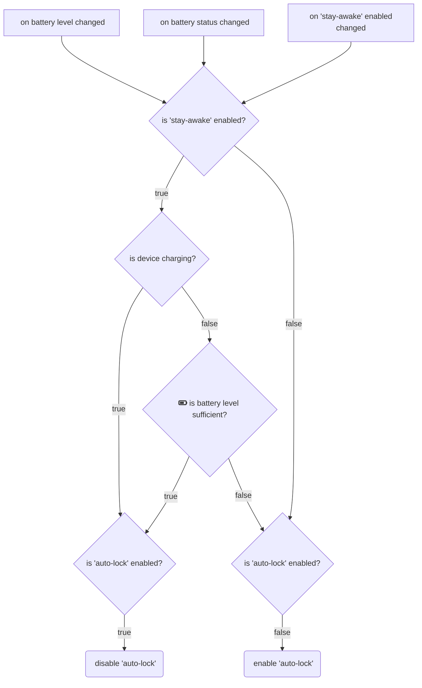

Licensed under the LGPL license

Copyright (c) [Kokleeko S.L.](https://github.com/kokleeko) and contributors. All rights reserved.
 Licensed under the LGPL license. See [LICENSE](../blob/master/LICENSE) file in the project root for details.

# Device Management
## iOS/iPadOS
### Battery saving strategy

✍️ Edit this chart

[🧜‍♀][battery-saving-stratey-flowchart] Open it in [Mermaid Live](https://mermaid.live/ "This link will lead you to Mermaid Live, to edit the chart click on the mermaid (🧜‍♀️)")

[battery-saving-stratey-flowchart]: https://mermaid.live/edit#pako:eNqVVM1ygjAQfpVMZhzbGXkBDu1YtSdv9lZ6WJJFMoakDUHroO_e8GOLCGnLgWE238-y-0FJmeZIQ5pIfWApGEtelpGaTMgSmQQDVmgVKeKuGKxFc1zjHuUiBbVF_ppAmEAgVKw_3Z1odUERWcEIa3BvVwobC7bIf5fIa1xPwxWP8wPscKUglsjHZaYVNIAKOyXYoHtiIt_05EqRDxIfzxeGMzRbobZl49g2G8RaWndKOO4Fw8qnRv3wNkWSCCZQ2afOIHsqNjWIwUfh9oAmr_Su55l_i1yEm_7mhdVrzXaLFNmufQtwtUC64s1LXHPuuqPThW2PuwL3DY-L_P9mPdKNW3ves6sj-OwyOZo9EgQPAwscT5qXMBIrL-e2XsNP1hR46iTFj05A5g4-uEfPij3kflK7XQ2v0LdeD3vYqO1pLPH-7-Gvvfr5vpnSGc3QZCC4--uVlVpEbYoZRjR0jxwTKKSNaKTODlq8c7C44sJqQ8Nad0arpG6OitGwavQCWgrYGsha1PkLhUDnlw "Battery Saving Strategy Chart" 

